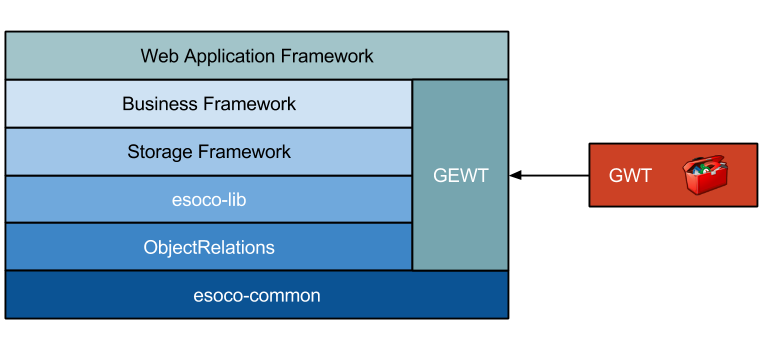

# Introduction

The **Simple Development Application Component Kit** \(aka SDACK\) project is basically a stack of frameworks. Each of the stack levels defines an abstraction of a certain problem domain like presentation \(= user interface\) or persistence. The purpose of these abstractions is to hide the complexity of the underlying technologies \(which are not imposed by the framework\) and therefore provide simple to use components for the building of applications. Together they provide a foundation that allows to create process-oriented, interactive applications that can easily be connected to existing or new business data.

To create a SDACK application you define processes and entities. Processes encapsulate the business logic and entities the persistent state of the application. The foundation of SDACK is the **ObjectRelations** framework. It allows the generic modeling of relations between objects, like object orientation defines the modeling of objects.

The following illustration displays the current framework stack:

SDACK provides all components that are necessary to write applications for different purposes. This covers areas like persistence, networking, logging, user interface, and more. For web applications it has a single dependency to the open source [GWT project](http://gwtproject.org), but that is not accessed directly. Instead it is used through a simplified abstraction \(GEWT\). Such abstractions are one of the main properties of SDACK and makes projects widely independent from external APIs. Other external dependencies depend on the application environment, e.g. JDBC database drivers. The full framework stack is compact, in code size as well as considering the number of API methods to learn.

The main goal of SDACK is to make application development as easy as possible while still providing the full functionality of all underlying APIs. The major building block for this is the [ObjectRelations](introduction.md) framework. It introduces a new programming paradigm that is the foundation of all upper levels of the stack. A major design principle of all frameworks is to hide as much non-essential code from the developer as possible. It provides simple to use APIs that need no configuration for default behavior. They also use modern software design patterns like Generics, Functional Programming, and Fluent Interfaces.

The following sections provide an overview of the single framework layers. They also link to detailed documentation for the respective layer.

## [esoco-common](https://github.com/esoco/sdack/tree/5ae03b773cd2e020e88216a68625fc7d8edbc8d0/esoco-common.md)

This library contains a small set of essential functionality like core interfaces and fundamental data structures. It is the foundation of the ObjectRelations framework and uses only a small set of standard Java APIs. That allows to use it in constrained Java environments like GWT where only a subset of these APIs is available.

## ObjectRelations

The Object Relations library implements a new development concept. The idea is to enhance object-oriented software development by modeling the relations between objects. The other frameworks make extensive use of generic relations to achieve their purpose because by using relations code becomes typically much more efficient. In addition the ObjectRelations project also contains packages for functional programming which is also used in many of the dependent frameworks. These packages are quite simliar to the new functional programming code introduced in Java 8.

It is recommended to study the ObjectRelations documentation before the other frameworks to get an understanding of the underlying principles.

## esoco-lib

This library contains several packages with generic code that will be helpful for almost any development project. It defines fundamental data structures and interfaces as well as utility functions for several areas like I/O, reflection, string handling and more. It builds upon the **esoco-common** project but is not compatible with the Javascript generation of GWT because it requires a full Java Runtime Environment.

## Storage Framework

The storage framework \(in the project esoco-storage\) provides a simple but powerful abstraction to implement object persistence. It's generic and simple API can be adapted to different persistence concepts like object oriented databases or key-value stores \(aka NoSQL databases\). It already comes with JDBC-based implementation for the common case of SQL databases. It provides direct persistence for arbitrary Java objects \(POJOs\) without the need for configuration beside the actual database connection. It is built on the ObjectRelations framework and the functional programming framework therein. Predicates from the latter define the query criteria in a fluent way.

## Business Framework

The business framework \(esoco-business\) is the foundation for business-related applications. The term _business_ in this context stands for higher-level abstractions, not as a limititation to commercial purposes. This framework provides the means to model persistent data entities and to define processes that modify such data and interact with users or external parties. Processes can display and query data to users through application-specific user interfaces. Entities can also be used to integrate existing databases into a new software project.

## GEWT

Most applications need some kind of user interface to display and collect data. The GEWT framework is a generic user interface abstraction that uses the open source Google Web Toolkit \(GWT\) as the actual user interface implementation. But GEWT has a generic and simple API that can be mapped on other component-based UI Toolkits if necessary. The EWT project does so for desktop applications based on Swing or SWT.

## GWT Web Application Framework

The Web Application Framework \(esoco-gwt\) is the bridge between the business framework and GEWT. It combines the business back-end \(processes and persistent entities\) with a GWT user interface to build client-server web applications. The user interface is generated from process state and input from the user is persisted automatically.

The Webapp framework also contains the base classes and core elements necessary to create an application that can be deployed into an application server. For persistence it uses a connection to a standard relational database like PostgreSQL or MySQL. Such applications already support the automatic historization of changes in persistent data, logging, and background processing. It is only necessary to implement the business-specific entities and processes to create a full application.

